# TextFlow Sentiment

TextFlow Sentiment — локальный MLOps-пайплайн для бинарной классификации тональности текста. В проекте ClearML используется для трекинга экспериментов, версионирования датасета, регистрации модели, удаленного запуска через очередь агента и model serving. Модель — scikit-learn pipeline: `TfidfVectorizer` + `LogisticRegression`.

Gradio UI сделан тонким клиентом: он отправляет HTTP-запросы в ClearML Serving и не загружает модель в процесс интерфейса.

## Структура репозитория

```text
dataset/create_dataset.py      # генерация CSV и регистрация ClearML Dataset
train/train.py                 # удаленное обучение sklearn-модели через ClearML Agent
registry/register_model.py     # выбор лучшего завершенного эксперимента и публикация модели
serving/preprocess.py          # preprocess/postprocess адаптер для ClearML Serving
ui/app.py                      # Gradio UI для HTTP endpoint
scripts/run_experiments.ps1    # два запуска обучения с разными гиперпараметрами
scripts/check_endpoint.ps1     # HTTP-проверка serving endpoint
docker-compose.yml             # ClearML Server, ClearML Serving runtime, Gradio UI
screenshots/                   # подтверждающие скриншоты выполненного локального запуска
```

## Требования к окружению

```powershell
python -m venv .venv
.\.venv\Scripts\Activate.ps1
pip install -r requirements.txt
Copy-Item .env.example .env
```

## ClearML Server

```powershell
docker compose up -d
```

Локальные сервисы:

```text
ClearML UI:    http://localhost:8090
ClearML API:   http://localhost:8008
ClearML Files: http://localhost:8081
```

Учетные данные создаются в ClearML UI: `Settings -> Workspace -> Create new credentials`.

Локальный ClearML SDK настраивается командой:

```powershell
clearml-init
```

Рекомендуемые endpoint для Windows/Docker Desktop:

```text
web_server:   http://localhost:8090
api_server:   http://localhost:8008
files_server: http://host.docker.internal:8081
```

Сгенерированные `access_key` и `secret_key` также указываются в `.env`. Файл `.env` локальный и исключен из Git.

## ClearML Agent

Агент запускается в отдельном PowerShell-терминале и остается открытым, пока обрабатываются задачи обучения:

```powershell
.\.venv\Scripts\Activate.ps1
clearml-agent daemon --queue students --create-queue --foreground
```

Очередь проекта: `students`.

## Dataset

```powershell
python .\dataset\create_dataset.py
```

Скрипт создает локальные `train.csv` и `test.csv`, регистрирует финализированный ClearML Dataset `textflow-sentiment-reviews` и записывает id датасета в `dataset/dataset_id.txt`.

## Training

```powershell
.\scripts\run_experiments.ps1
```

Скрипт отправляет в очередь `students` две удаленные задачи обучения:

```text
max_features=800,  ngram_max=1, C=0.7
max_features=1600, ngram_max=2, C=1.8
```

В ходе обучения логируются метрики валидации `accuracy`, `f1`, `f1_weighted`, confusion matrix, сериализованный `sentiment_pipeline.joblib` и ClearML OutputModel.

В проверенном запуске лучшей стала вторая конфигурация с `validation/f1 = 0.8649`.

## Model Registry

После завершения двух задач обучения:

```powershell
python .\registry\register_model.py
```

Скрипт выбирает лучшую завершенную задачу по `validation/f1`, публикует ее OutputModel и записывает id выбранной модели в `registry/model_id.txt`.

## ClearML Serving

Создание управляющей задачи ClearML Serving:

```powershell
clearml-serving create --name textflow-serving
```

Полученный id сервиса записывается в `.env`:

```text
CLEARML_SERVING_TASK_ID=<SERVICE_ID>
```

Добавление опубликованной модели в serving endpoint:

```powershell
$ServiceId = "<SERVICE_ID>"
$ModelId = (Get-Content .\registry\model_id.txt -Raw).Trim()
$Preprocess = (Resolve-Path .\serving\preprocess.py).Path
clearml-serving --id $ServiceId model add --engine sklearn --endpoint text-sentiment --model-id $ModelId --preprocess $Preprocess
```

Запуск runtime-контейнера ClearML Serving:

```powershell
docker compose --env-file .env --profile serving up -d --build clearml-serving
```

Проверка endpoint:

```powershell
.\scripts\check_endpoint.ps1
```

Ожидаемый формат ответа:

```text
label     label_id
-----     --------
positive  1
```

## Gradio UI

```powershell
docker compose --env-file .env --profile serving --profile ui up -d --build ui
```

Адрес UI:

```text
http://localhost:7860
```

UI обращается к Docker-internal endpoint `http://clearml-serving:8080/serve/text-sentiment`. Для локального запуска UI без Docker:

```powershell
$env:SERVING_ENDPOINT="http://localhost:8082/serve/text-sentiment"
python .\ui\app.py
```

## Подтверждающие материалы

Папка `screenshots/` содержит подтверждения выполненного локального запуска. В README добавлены компактные превью; полные изображения доступны в самой папке.

| Этап | Скриншот |
| --- | --- |
| ClearML agent | 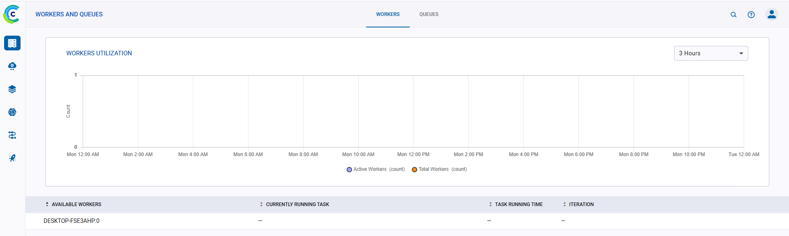 |
| ClearML queue | 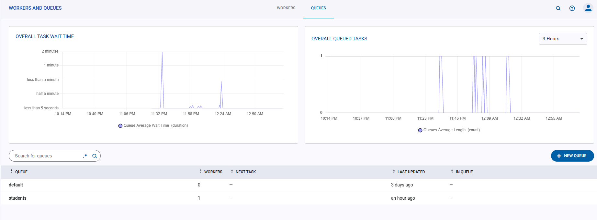 |
| Dataset | 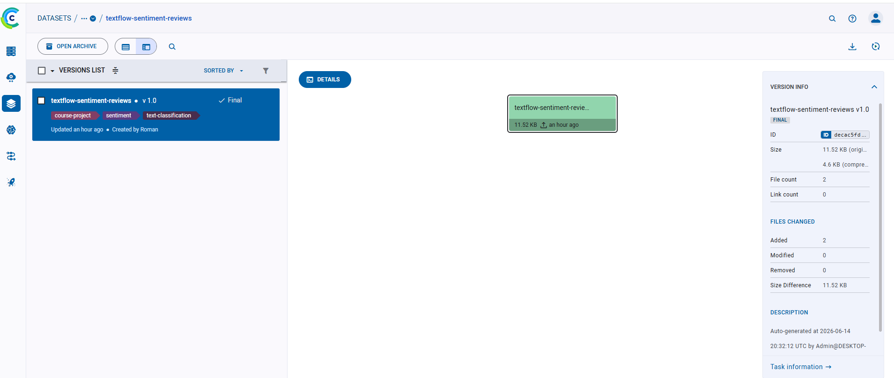 |
| Training experiments | 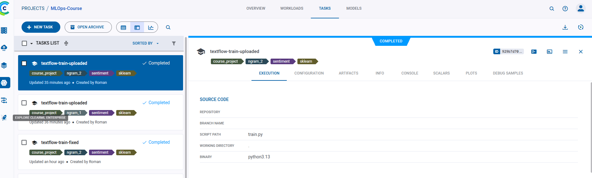 |
| Metrics | 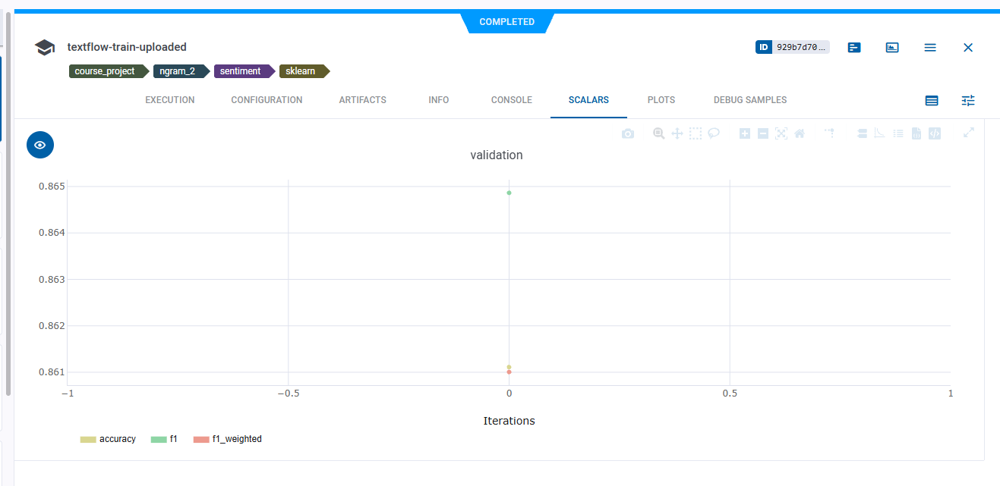 |
| Model artifact | 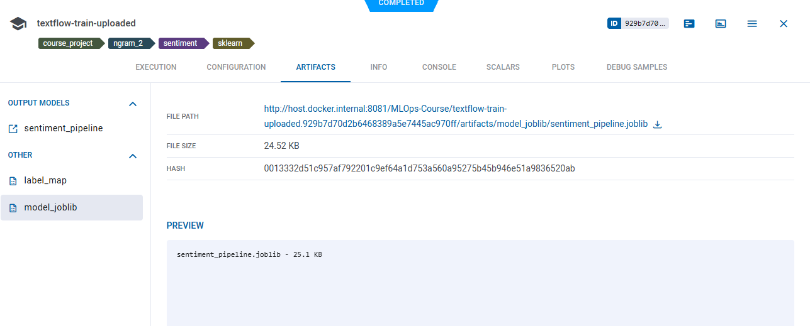 |
| Registered model | 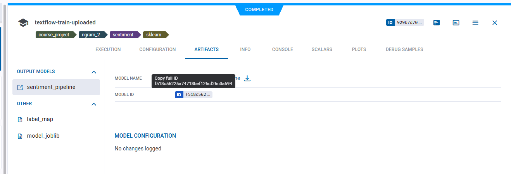 |
| Serving service | 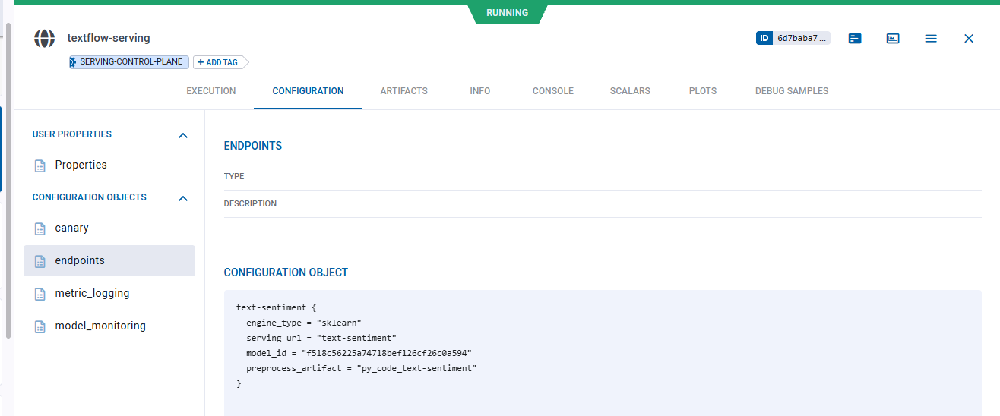 |
| Gradio UI | 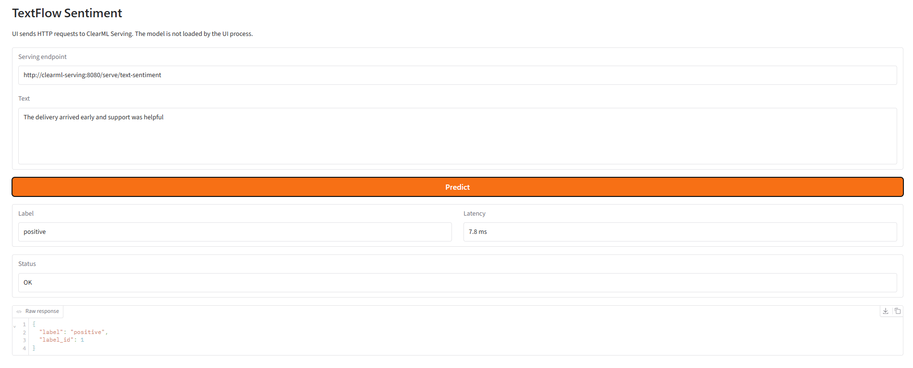 |
| Endpoint check | 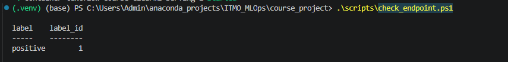 |
| Docker services | 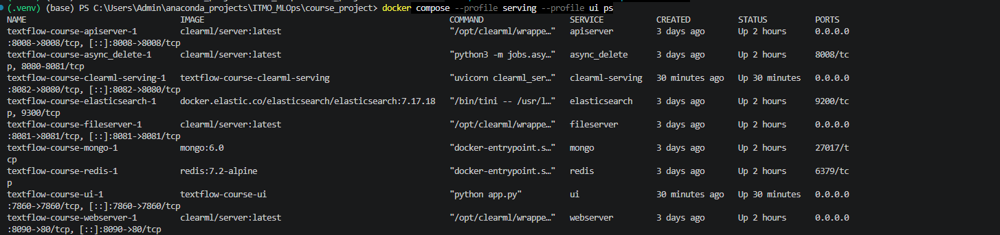 |

## Очистка

Остановка runtime-контейнеров:

```powershell
docker compose --profile serving --profile ui down
```

Остановка runtime-контейнеров и удаление локальных ClearML volumes этого compose-проекта:

```powershell
docker compose --profile serving --profile ui down -v
```

Опция `-v` удаляет локальную базу ClearML, файлы артефактов и историю экспериментов, созданные этим compose-проектом.
